  

# Sharpshooter

Chrome MV3 extension for high-resolution, clean screenshots of web pages and
individual elements. Built for MotionGFX, archiving, and general asset creation.
All capture uses the Chrome DevTools Protocol (`chrome.debugger`) for device
emulation + `Page.captureScreenshot`.

> The popup has a built-in **?** help panel — this README is the high-level
> overview; the help panel covers day-to-day usage.

## Installation

1. Clone or download this repo.
2. Go to `chrome://extensions/`.
3. Enable **Developer Mode** (top-right toggle).
4. Click **Load unpacked** and select the extension folder.

## Capture modes

All captures start from the toolbar popup.

- **Capture this post / story** — appears at the top of the popup only when the
  active tab is a single post or story on a supported social site. One click
  cleans up the page and captures just that post/story element.
- **Page Capture** — captures the page at a chosen resolution preset and scale.
- **Capture Element** — interactively pick any DOM element: hover to highlight
  (cyan glow), scroll wheel to walk the DOM tree (up = parent, down = child),
  click to capture.

Each capture button is split: the main button captures and saves directly,
the narrow **with crop** segment routes the shot through the crop editor
first. When **Always open the crop editor** is enabled in Settings, every
capture goes to the editor and the separate segments are hidden.

Captures download as `page-…` / `element-…` named with the domain and a
timestamp (and an optional filename prefix set in Settings). Output format is
PNG by default, or JPEG — both configurable in Settings.

## Resolution presets (Page Capture)

| Preset      | Width         | Height                    |
| ----------- | ------------- | ------------------------- |
| User        | tab viewport  | tab viewport              |
| Full Page   | tab viewport  | measured live page height |
| Vertical HD | 1920          | 7000                      |
| FullHD      | 1920          | 1080                      |
| 4K          | 3840          | 2160                      |
| Custom      | user-editable | user-editable             |

Presets can be reordered, shown/hidden, and the fixed-dimension ones edited or deleted in Settings. New presets can be added; **Restore factory presets** resets the list.

**Quality multiplier** — 1× / 2× / 3× / 4× (`deviceScaleFactor`); default 2×.
Max output is 16384 px per side (CDP limit).

## Supported social sites

| Site            | Post | Story | Notes                          |
| --------------- | :--: | :---: | ------------------------------ |
| Facebook        |  ✓   |   ✓   | also detects group posts       |
| Instagram       |  ✓   |   ✓   |                                |
| X / Twitter     |  ✓   |       |                                |
| Telegram (t.me) |  ✓   |       |                                |
| VK              |  ✓   |       |                                |
| Threads         |  ✓   |       |                                |

The "Capture this post/story" prompt only shows when the URL looks like a
single post/story page. Feed and profile pages fall through to Page Capture.

## Helpers

- **Remove Elements** — interactive click-to-remove tool. Hover + scroll wheel
  to target, click to delete an element; **Ctrl/Cmd+Z** undoes the last
  removal.
- **Extract Image** — hover any element (amber highlight), scroll wheel or arrow
  keys to walk the DOM, click to scan the subtree for raster images (``,
  `<picture>`, CSS background). One result downloads directly; multiple results
  open a picker so you can choose. Each button is split: the main segment
  downloads as PNG, the narrow **with crop** segment sends the image to the
  crop editor. CDN size-suffix stripping is attempted automatically to fetch the
  largest available source.

## Settings

The header **gear** icon opens the Settings panel:

- **Output** — PNG or JPEG; JPEG quality slider; re-encode PNG as opaque
  (flattens onto white and strips alpha / colour-profile chunks, fixing Adobe
  ScriptUI / Direct2D panels that reject the screenshots — on by default,
  hidden in JPEG mode).
- **Downloads** — filename prefix prepended to every saved file. Chrome's
  native "Save as" dialog always shows — there is no setting to skip it.
- **Capture** — always open the crop editor; full-page height limit
  (capped at Chrome's 16384 px maximum); **Enable Legal Capture** (see below).
- **Appearance** — theme override (Auto / Light / Dark) and language override
  (Auto / English / Русский) for the popup.

## Legal Capture

An opt-in specialist mode for when a plain screenshot isn't strong enough
evidence — e.g. investigative or legal use. Turn it on via **Enable Legal
Capture** in Settings; a **Legal Capture** section then appears at the bottom
of the main popup view.

Instead of a single image, it produces a downloaded zip containing:

- **`capture.wacz`** — a byte-exact recording of the actual network exchange
  for the page (all requests/responses, headers, and bodies), replayable
  independently of this extension at [replayweb.page](https://replayweb.page).
- **`screenshot.png`** — a visual capture taken during the same session.
- **`capture.tsr`** — an RFC 3161 timestamp token from the public FreeTSA
  authority, requested automatically for every capture, proving the capture's
  hash existed at a given time independent of this tool's own clock. Verify it
  yourself with `openssl ts -reply -in capture.tsr -text`.
- **`manifest.json`** / **`report.txt`** — the capture's hash, TLS summary, and
  a plain-language explanation of what the package does and doesn't prove.

Before recording, Legal Capture always force-reloads the page (bypassing the
cache) — this both ensures the network recording reflects the real page load
and undoes any DOM edits made via **Remove Elements** or a live DevTools
session, so there's no separate step to remember. If a tab has had Remove
Elements used on it, a banner in the Legal Capture section says so; if native
DevTools is open on the tab, Legal Capture will ask you to close it first
(Chrome only allows one debugger client per tab at a time).

**This is supporting technical evidence, not a legal determination** —
`report.txt` spells out exactly what is and isn't proven; consult counsel on
how to present it. See [CLAUDE.md](CLAUDE.md#legal-capture) for the full
technical breakdown, and [PRIVACY.md](PRIVACY.md) for what the FreeTSA request
does and doesn't send.

## How it works

1. Attach `chrome.debugger` to the active tab.
2. Emulate device metrics (`Emulation.setDeviceMetricsOverride`).
3. Wait for the page to settle (MutationObserver-based).
4. Capture with `Page.captureScreenshot`.
5. Detach and download the image (PNG/JPEG per Settings). Element captures are
   cropped from the viewport shot in JS (`OffscreenCanvas`) for accuracy.

See [CLAUDE.md](CLAUDE.md) for the full architecture reference.
